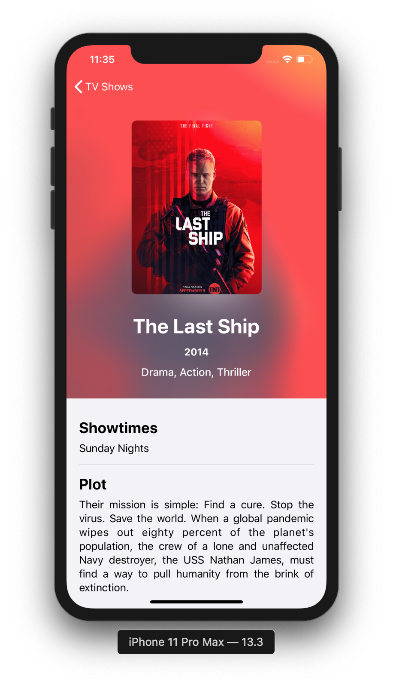
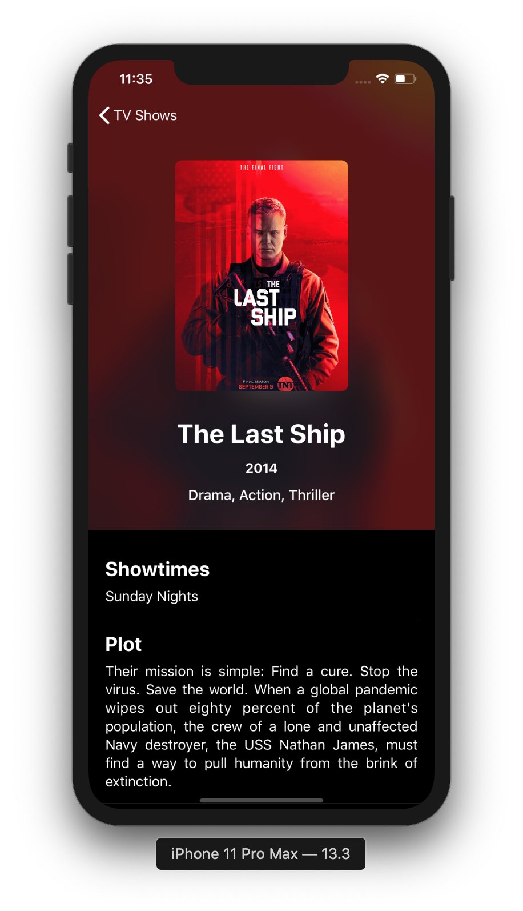

# Flix
### Assessment Repository
#### Mark Di Dio

### Dark Mode (iOS 13)

On devices running iOS 13 or later, apps can take advantage of Apple's system wide Dark Mode.

Light Mode|Dark Mode
:-:|:-:
  |  

This can be applied using the stock standard background colours or linking to the system mode listener.

```swift
func listen() {
// Change your visual fields here
}
```
<sup>[1]Flix<sup>

### API Calls

Closures are used in functions to access data in the background.

```swift
func loadAllShows(completion: @escaping ([Show])->()) {
    let fullURL = AppConstants.baseURL + AppConstants.allShowsURL
    loadShows(from: fullURL, completion: completion)
}
```

#### Threading

The `@escaping` parameter paired with a dispatch queue forces data back onto the main thread before modifying the user-interactive layer.

```swift
APICalls.get.loadAllShows { (shows) in
    DispatchQueue.main.async {
        self.shows = shows
    }
}
```
