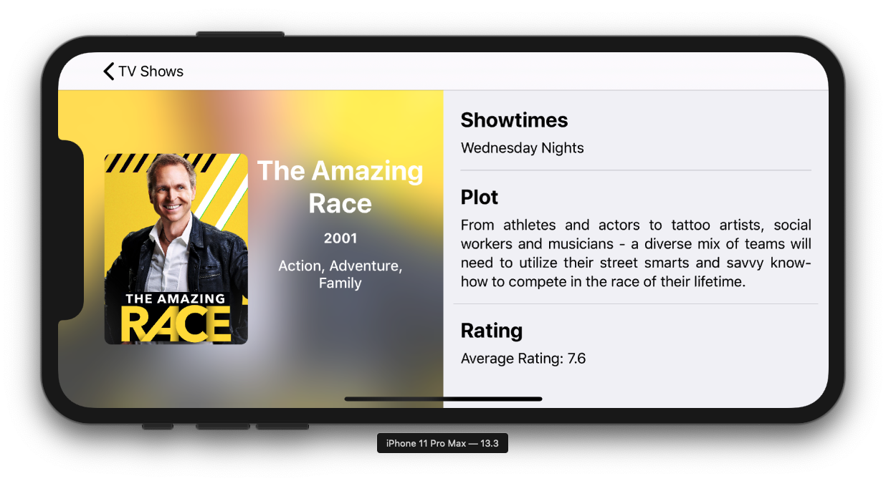

# Flix
### Assessment Repository
##### Created by Mark Di Dio
<br>

This repository consists of a simple TV Show application to demonstrate my strengths and coding abilities. Please clone or download the files to access the XCode project. For my skills, experience and more, please refer to my resume previously sent to you. If you have any other questions please feel free to contact me. I hope you will consider me for employment.

### API Calls
`URLSession.shared.dataTask()` returns data from a specified URL address. Closures are used in functions to access data from a background task.

```swift
func loadShows(from urlString: String, completion: @escaping ([Show])->()) {

    // Safely unwrap the URL string as a valid URL.
    if let url = URL(string: urlString) {
        URLSession.shared.dataTask(with: url) { (data, response, error) in
        
            // Access returned data and safely unwrap it.
            guard let data = data,
                let json = try? JSONSerialization.jsonObject(with: data),
                let jsonArray = json as? [[String: AnyObject]] else { return }
                
            // Convert json data into an array of Show objects.
            let shows = jsonArray.map { (jsonShow) -> Show in
                if let innerJsonShow = jsonShow["show"] as? [String: AnyObject] {
                    return Show(json: innerJsonShow)
                } else {
                    return Show(json: jsonShow)
                }
            }
                
            // Returns data within a completion to be used later within the closure. 
            completion(shows)
                
        }.resume()
    }
}
```
<sup>Flix - Created by Mark Di Dio<sup>

##### Threading

The `@escaping` parameter paired with a dispatch queue forces data back onto the main thread before modifying the user-interactive layer.

```swift
APICalls.get.loadAllShows { (shows) in
    self.shows = shows
    DispatchQueue.main.async {
        self.tableView.reloadData()
    }
}
```
<sup>Flix - Created by Mark Di Dio<sup>
<br>
    
### Image Cache
Caching images is used to save memory and limit processing power within the app. The caching system is stored in a singleton to enable multiple requests to the same instance.

```swift
class ImageCaching {
    static var get: ImageCaching = ImageCaching()
    var imageCache: [String: UIImage] = [:]
    ...
}
```
<sup>Flix - Created by Mark Di Dio<sup>
<br>

### Design
While this sample app is intended to demonstrate my development abilities, it also showcases my layout and designing skills. The app consists of a clean user interface and adheres to Apple's Human Interface Guidelines.

##### Dark Mode (iOS 13)

On devices running iOS 13 or later, apps can take advantage of Apple's system wide Dark Mode.

Light Mode|Dark Mode
:-:|:-:
  |  

This can be applied using the stock standard background colours or by linking to the `traitCollection.userInterfaceStyle` listener.

```swift
let responsiveColor = UIColor { (traitCollection: UITraitCollection) -> UIColor in
    switch traitCollection.userInterfaceStyle {
    case .dark:
        return .black
    default:
        return .white
    }
}
```
<sup>Flix - Created by Mark Di Dio<sup>
<br>
     
##### Adaptive Layout
Adaptive layout is achieved by varying traits within the storyboard to ensure the perfect fit on all screen sizes.

<br>

### Cell Initialisation

Within a table or collection view's `cellForRowAt indexPath: IndexPath` delegated function, cells are initialised within themselves. This clears up any unnecessary data that the hosting view controller shouldn't know about.

```swift
let cell = tableView.dequeueReusableCell(withIdentifier: "ShowCell", for: indexPath) as! ShowCell
cell.initCell(show: shows[indexPath.row])
```
<sup>Flix - Created by Mark Di Dio<sup>
<br>
    
### Unit Tests
Test Driven Development (TDD) is favorable as it allows you to create a testable software that asserts your code is functioning correctly. It is especially useful when major code changes occur and you need to test that old code is functioning the same as before.

##### Testing Setup 
```swift
weekends = show.getReadableSchedule(showSchedule: [
    "time": "23:35" as AnyObject,
    "days": [ "Saturday", "Sunday"] as AnyObject
])
```
<sup>Flix Unit Tests - Created by Mark Di Dio<sup>

##### Testing Showtime Whitespaces
```swift
func testWhiteSpaces() {
    XCTAssertFalse(weekdays.first == " ")
    XCTAssertFalse(weekdays.last == " ")
}
```
<sup>Flix Unit Tests - Created by Mark Di Dio<sup>

##### Testing Showtime Contents
```swift
func testContents() {
    XCTAssertTrue(weekdays == "Weekday Nights")
    XCTAssertTrue(weekends == "Weekend Nights")
}
```
<sup>Flix Unit Tests - Created by Mark Di Dio<sup>
<br>
<sup>Please Note: Sample code may differ from project code for readability and context.<sup>


